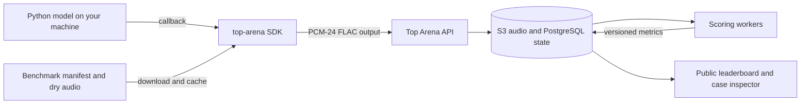

# Top Bench

Top Bench is the open-source project behind [Top Arena](https://top-arena.labqoat.com),
a reproducible benchmark and public leaderboard for guitar-amplifier and neural-audio
models.

The project was created to make audio-model comparisons repeatable. A model should be
judged against the same dry performances, control positions, reference captures, audio
alignment, and metric implementation as every other model—not against a hand-picked
demo. Top Bench keeps those rules on the server while letting authors run private or
experimental models on their own hardware.

This repository contains both parts of that system:

| Component | Purpose |
| --- | --- |
| [`packages/top-arena`](packages/top-arena) | The typed Python SDK that runs a model locally and submits rendered audio. Published on PyPI as `top-arena`. |
| [`apps/leaderboard`](apps/leaderboard) | The FastAPI service, scoring workers, API, and server-rendered leaderboard. |
| [`infra`](infra) | Database migrations, systemd service, Caddy routing, and production operations. |
| [`tools`](tools) | Maintainer tooling for the reference corpus and NAM baselines. |

## How it works

The model never has to be uploaded to Top Arena. The SDK and the web service cooperate
through a public HTTP API:



For each benchmark case, the SDK downloads a dry input, passes the local file and its
control-position matrix to the user's callback, converts the returned wet audio to
lossless PCM-24 FLAC, and uploads it. Downloads, inference, and uploads use bounded
overlapping queues, so I/O can continue without unbounded memory use while the model
is rendering. Dry files are cached by content hash.

The server records every run and stage transition, stores audio in S3, scores candidate
audio against the aligned reference, aggregates the result, and exposes it through the
API and leaderboard. PostgreSQL is the source of truth for benchmark manifests, run
state, case results, aggregates, and the append-only progress log.

The current reference dataset covers 48 guitar amplifiers. Each amplifier uses 15
complete, diverse 16-beat dry DI loops at ten static control positions: 150 cases per
amplifier and 7,200 reference cases overall. Dry audio, reference wet audio, and
submitted wet audio are stored as lossless PCM-24 FLAC.

## Use the Python package

The supported runtimes are CPython 3.13 and 3.14. Install from PyPI:

```bash
uv add top-arena
```

or:

```bash
python -m pip install top-arena
```

The distribution uses a hyphen, while the import uses an underscore. Create one run
and provide a synchronous or asynchronous callback that returns a SoundFile-supported
audio path:

```python
from pathlib import Path

from top_arena import PipelineOptions, PositionMatrix, benchmark

from my_model import render_audio

run = benchmark.create(
    name="super-model-v1",
    creator="your-name",
    unique_positions_used=1,
    audio_duration_sum=4_000.0,
    turns=1,
    training_time=5_000.0,
    description="Model architecture and training-data summary",
    parameter_count=40_000,
    options=PipelineOptions(
        download_concurrency=4,
        run_concurrency=1,
        upload_concurrency=4,
        report_format="agent",
        report_min_finding_signal=1.0,
        report_min_evidence_signal=1.0,
    ),
)


async def model(dry_audio: Path, positions: PositionMatrix) -> Path:
    return await render_audio(dry_audio, positions)


result = run.run("D3D21964-8E80-11EE-B9D1-0242AC120002", model)
print(result.metrics)
```

Use `await run.run_async(...)` when an async event loop is already running.
`run_concurrency` defaults to one because GPU runtimes and plugin hosts are often not
safe to invoke in parallel. The public service is the default; set
`TOP_ARENA_SERVER_URL` or pass `server_url=` to target another deployment.

See the [complete package guide](packages/top-arena/README.md) for callback details,
metadata definitions, pipeline options, caching, error behavior, and result fields.
[`examples/passthrough_benchmark.py`](examples/passthrough_benchmark.py) is a runnable
end-to-end smoke test. Release changes are recorded in [`CHANGELOG.md`](CHANGELOG.md).

The client uses bounded download → inference → upload queues. Each stage overlaps the
others, dry files are cached by content hash, and every stage transition is sent to the
server event log. `realtime_x` is audio duration divided by model wall time.
Speed is higher-is-better and is evaluated against a 31x NAM-FULL target; 15.5x is the
acceptable floor. Merely exceeding 1x is not classified as a strength.

## Use the web application

The [Top Arena web application](https://top-arena.labqoat.com) serves three audiences:

- model authors can watch submissions progress and inspect final scores;
- researchers can compare results across amplifiers, creators, training budgets, and
  control-position counts;
- listeners can open a run and audition dry, reference, candidate, and NAM baseline
  audio for individual cases.

The leaderboard shows status, aggregate metrics, speed, and the Pareto frontier for
mean ESR versus control-position coverage (unique training positions multiplied by the
amp's knobs and switches). Lower ESR and higher coverage are better. Every model links to
a lazy-loaded case inspector at `/runs/{run_id}/cases/{case_id}`. The selected case is
preserved in copied URLs and browser history, while large audio objects are only loaded
when playback begins. Interactive API documentation is available at
[`/docs`](https://top-arena.labqoat.com/docs), and the health endpoint is `/health`.

There is currently no account system or private API surface. Model metadata and
submitted outputs are intended for the public benchmark. The SDK uploads model output
audio; it does not upload model weights, source code, or private training data.

To see the complete progress and report experience locally, with no external server or
dataset, run:

```bash
uv run python examples/local_diagnostic_demo.py
```

The `agent`, `text`, `json`, and `jsonl` modes, stream guarantees, and report fields are
documented in [`docs/running-benchmark-cli.md`](docs/running-benchmark-cli.md). Metric
meaning and interpretation limits are documented separately in
[`docs/interpreting-benchmark-results.md`](docs/interpreting-benchmark-results.md).

## Scores

The metric contract and its FFT configuration are stored with every completed run.
The primary error metrics are minimized:

- **ESR** is sample-domain error energy divided by reference energy.
- **Human-weighted ESR** applies A-weighting in the frequency domain before comparing
  error and reference energy.
- **MRSTFT** averages spectral-convergence and log-magnitude losses at the fixed
  `512`, `1024`, and `2048` FFT resolutions.

The service also reports render speed (`realtime_x`), level and peak deltas, and
zero-lag Pearson correlation. Aggregate results contain mean, P90, best, and worst
values. The inspector stores 100 ms time-series points for ESR, reference/candidate
RMS, reference/candidate peak, and correlation; silence uses a finite −120 dBFS floor.

## Local development

The monorepo is a [uv](https://docs.astral.sh/uv/) workspace with a shared lockfile.
Development defaults to SQLite and filesystem object storage under `data/`, so the web
application can run without PostgreSQL or S3:

```bash
uv sync --locked --all-packages --all-groups
uv run --package top-arena-leaderboard top-arena-server
```

Open [http://127.0.0.1:8000](http://127.0.0.1:8000). Seed a local benchmark from one
dry source and aligned wet sources with:

```bash
uv run --package top-arena-leaderboard top-arena-seed \
  --source /path/to/190-second-dry.wav \
  --wet /path/to/setting-01.wav \
  --wet /path/to/setting-02.wav \
  --wet /path/to/setting-03.wav \
  --wet /path/to/setting-04.wav \
  --wet /path/to/setting-05.wav
```

Run the same quality gates as CI:

```bash
uv lock --check
uv run ruff format --check .
uv run ruff check .
uv run mypy
uv run pytest
npm ci --ignore-scripts
npm run test:ui
uv run alembic -c infra/alembic.ini upgrade head
uv run alembic -c infra/alembic.ini check
```

## Deployment and releases

GitHub Actions keeps the two deliverables independent:

- `deploy-web.yml` runs on `main` only when leaderboard, migration, runtime, lockfile,
  or deployment files change. It securely copies the relevant workspace files to the
  production host, installs the locked environment, applies migrations, validates
  Caddy, restarts systemd, and checks `/health`.
- `publish-package.yml` runs on `main` only when `packages/top-arena` or its publishing
  workflow changes. It tests and builds both a wheel and source distribution, verifies
  the wheel in a clean environment, and publishes through PyPI Trusted Publishing.

Automated PyPI builds use a PEP 440 post-release version based on the declared package
version and workflow run number, such as `0.2.0.post17`. Change the base version in
`packages/top-arena/pyproject.toml` when the public compatibility line changes.
Long-lived PyPI credentials are not stored in GitHub.

Production uses one systemd-managed process behind Caddy, PostgreSQL over its local
Unix socket, and the EC2 instance role for S3. Setup, required GitHub variables and
secrets, first deployment, verification, and rollback are documented in
[`infra/README.md`](infra/README.md).

## Server configuration

Runtime settings use the `TOP_ARENA_` prefix. The production template is
[`infra/systemd/top-arena.env.example`](infra/systemd/top-arena.env.example). The most
important values are:

- `TOP_ARENA_DATABASE_URL`
- `TOP_ARENA_STORAGE_BACKEND=filesystem|s3`
- `TOP_ARENA_S3_BUCKET`, `TOP_ARENA_S3_PREFIX`, and `TOP_ARENA_S3_REGION`
- `TOP_ARENA_PUBLIC_BASE_URL`
- `TOP_ARENA_SERVER_HOST` and `TOP_ARENA_SERVER_PORT`

Top Bench is released under the [MIT License](LICENSE).
